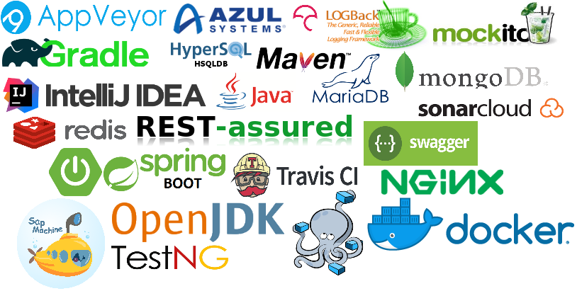

[](https://ci.appveyor.com/project/jonathanlermitage/manon) [](https://travis-ci.org/jonathanlermitage/manon) 
[](https://codecov.io/gh/jonathanlermitage/manon/branch/spring5-light) [](https://sonarcloud.io/dashboard?id=nanon%3Amanon-light) [](https://github.com/jonathanlermitage/manon/blob/master/LICENSE.txt)

1. [Project](https://github.com/jonathanlermitage/manon#project)  
2. [Author](https://github.com/jonathanlermitage/manon#author)
3. [Branches](https://github.com/jonathanlermitage/manon#branches)
4. [Compilation and test](https://github.com/jonathanlermitage/manon#compilation-and-test)
5. [License](https://github.com/jonathanlermitage/manon#license)

## Project

Some experimentation with Spring Boot 2, JDK8+, NoSQL, etc. It demonstrates usage of:

* **Maven** and **Gradle** build tools
* **Spring Boot 2** + Spring Framework 5 and migration from Spring Boot 1 + Spring Framework 4
* built with JDK8 and newer JDKs on Travis CI
* Spring Web, **REST** API
* Spring **Security**, to authenticate users via auth_basic, and fetch authentication data from MongoDB instead of default SQL database 
* Spring Data to serve data from a **MongoDB** database
* Spring **Batch** to schedule and manage some tasks
* Spring **Cache** via Redis for application, and prefer an embedded cache provider during tests
* **integration tests** and (some) unit-test via **TestNG**, because TestNG is so much superior to JUnit4/5... (better keywords, dataproviders, old/mature and very stable API, easily configurable, test suites)
* tests work with an **embedded MongoDB** instance (for data) and HSQLDB (for Spring Batch internals only), that means you don't have to install any database to test project, simply run `mvnw test` 
* integration with some free (for open-source) services like **[AppVeyor](https://ci.appveyor.com/project/jonathanlermitage/manon)** (Windows CI), **[Travis](https://travis-ci.org/jonathanlermitage/manon)** (Linux and MacOS CI), **[CodeCov](https://codecov.io/gh/jonathanlermitage/manon)** (code coverage), **[SonarCloud](https://sonarcloud.io/dashboard?id=nanon:manon)** (code quality) 
* Maven and Gradle wrappers, and a `do.cmd` script that helps you to launch some usefull commands
* code coverage thanks to **JaCoCo** Maven and Gradle plugin
* some **AOP** to capture performance of API endpoints
* Spring **Actuator** web endpoints configured
* **Swagger UI** to provide documentation about REST API endpoints

For fun and to show some skills :cat:

## Author

Jonathan Lermitage (<jonathan.lermitage@gmail.com>)  
**Your're Canadian or American and wanna hire an experienced French devops? Contact me! I'm okay to move.**  
Linkedin profile: [jonathan-lermitage-092711142](https://www.linkedin.com/in/jonathan-lermitage-092711142/)

## Branches

* active
  * [spring5](https://github.com/jonathanlermitage/manon/tree/spring5): based on Spring Framework 5, **Spring Boot 2** and JDK8/9, use Spring Web (REST API), Security, Data (regular and embedded MongoDB), Batch, Cache (Redis), AOP, Actuator, Swagger UI
  * **[spring5-light](https://github.com/jonathanlermitage/manon/tree/spring5-light)**: like [spring5](https://github.com/jonathanlermitage/manon/tree/spring5), JDK8+, without Spring Batch, Redis Cache, Swagger UI
* archived
  * [spring5-embedmongo](https://github.com/jonathanlermitage/manon/tree/spring5-embedmongo): use **embedded MongoDB** during tests. See commits [37e1be5](https://github.com/jonathanlermitage/manon/commit/37e1be5f01c3ffa6ecf4d9c3e558b4ffb297227f) and [161d321](https://github.com/jonathanlermitage/manon/commit/161d3214ab72e76a2f041bbe8914077137513fb7)
  * [spring5-swagger](https://github.com/jonathanlermitage/manon/tree/spring5-swagger): enable **Swagger UI**. Run application and check `http://localhost:8080/swagger-ui.html`, authenticate with `ROOT` / `woot`. See commit [429ae53](https://github.com/jonathanlermitage/manon/commit/429ae53bc5211d8d97e8ccca20a4b183f207c6ee)
  * [spring5-redis](https://github.com/jonathanlermitage/manon/tree/spring5-redis): enable **Redis cache**, and prefer embedded cache during tests. See commits [a911f6a](https://github.com/jonathanlermitage/manon/commit/a911f6a08ce67b3b302f4ea3d17a73e8a0dcd6e6), [7e26822](https://github.com/jonathanlermitage/manon/commit/7e268222a745e5bbb88129d99b91379bafac7f58) and [ae6e0e6](https://github.com/jonathanlermitage/manon/commit/ae6e0e69ac37dbe44b51f449600943e09b9b149b) 
  * [spring5-mvn-to-gradle](https://github.com/jonathanlermitage/manon/tree/spring5-mvn-to-gradle): migration from **Maven to Gradle**. Stable and functional, but still needs some improvements
  * [spring4](https://github.com/jonathanlermitage/manon/tree/spring4): previous active branch, based on Spring Framework 4, Spring Boot and JDK8
  * [spring4-redis-cache](https://github.com/jonathanlermitage/manon/tree/spring4-redis-cache): enable caching based on **Redis** server. See commit [0f1eff7](https://github.com/jonathanlermitage/manon/commit/0f1eff768e73a69e07016e153b825a131146a63a)
* other branches may appear and disappear quickly, depending on experimentation results and motivation ;-)

## Compilation and test

To build and test, simply run `mvnw test`. To enable JaCoCo code coverage, activate the `coverage` profile: `mvnw test -Pcoverage`.  
  
You can also use the `do.cmd` (Windows) or `do.sh` (Unix shell) script:  
```
do help      show this help message
do t         test without code coverage
do tc        test with code coverage
do sc        compute and upload Sonar analysis to SonarCloud, needs two env vars:
             - TK1_MANON_SONAR_ORGA   SonarCloud organization, e.g. jonathanlermitage-github
             - TK1_MANON_SONAR_LOGIN  SonarCloud authentication token
do tsc       similar to "do tc" then "do sc"
do b         build without testing
do c         clean
do p         package application to manon.jar
do rd        package and run application with dev profile 
do w 3.5.2   set or upgrade Maven wrapper to 3.5.2
do cv        check plugins and dependencies versions
do uv        update plugins and dependencies versions
do dt        show dependencies tree
```

## License

MIT License. In other words, you can do what you want: this project is entirely OpenSource, Free and Gratis.


